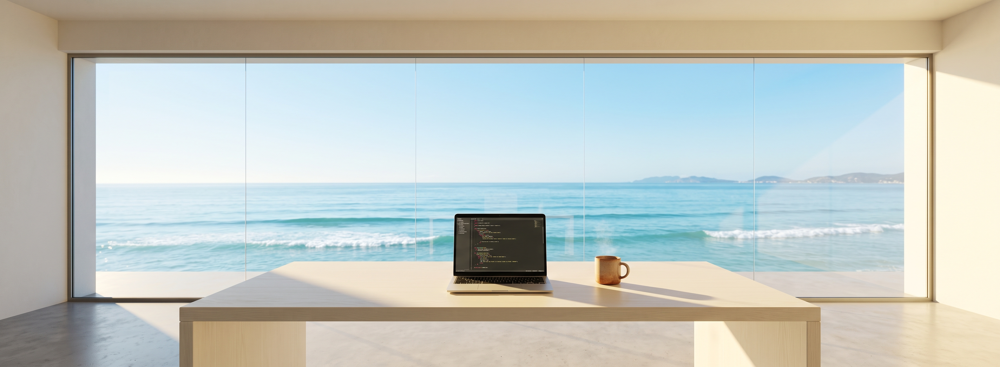

<!-- ============ Capsule Render — Macaron Blue Wave Header ============ -->

  

<!-- ============ Hero Image — Ocean Workspace ============ -->

  

 

<!-- ============ Profile / About Flow ============ -->

### Hi there, I'm Yuhao Liu (Luious) 👋

🎓 **M.Eng. in Electronic Information (Biomedical Engineering)** @ **Shenzhen University** (SZU)  
🔬 **Focus**: VLMs · PEFT (Adapter/LoRA) · AI Agents & VQA · Medical Segmentation  
🏆 **1st Author** in **IEEE TMM** *(CCF-A Under Review)*, **ICASSP 2026** *(CCF-B Published)*, **IEEE BIBM 2026** *(CCF-B Under Review)*  
🏅 **Honors & Patent**: **ASC25 Supercomputer Challenge** (2nd Prize) · **National Math Modeling** (3rd Prize) · 📜 **1 Invention Patent**  
🏠 **Personal Portal**: [liuaihub.com](https://www.liuaihub.com/) &nbsp;·&nbsp; 🌐 **Academic Homepage**: [luious-lyh.github.io](https://luious-lyh.github.io/) &nbsp;·&nbsp; 📬 **Email**: [862700320@qq.com](mailto:862700320@qq.com)

---

 

<!-- ============ Tech Garden (yuki4266-style animated blue chip SVGs) ============ -->

      
 
       
 
      
 
     
 
      
 
       

 

---

<!-- ============ Open Source & Projects ============ -->

<b>🛠️ Open Source & Projects</b>

 

- 🧠 **[TiBan (题伴)](https://github.com/Luious-LYH/TiBan)** — Agent-native Adaptive QBank & Learning Platform for Practice. A persistent Tutor, RAG, learning memory, FSRS review, Question Factory and model evaluation across Medical / Endoscopy and AI domains.
- 📊 **[huibao-skill (汇报Skill)](https://github.com/Luious-LYH/huibao-skill)** — **你做过的事，不该最后只剩一句“已完成”**。不要将时间浪费在：重复的汇报、日报、周报、月报上…. 去做你想做的事 ; 去爱你爱的人。
- 🚀 **Open Source & Commits** — 热爱开源与Agent生态，积极参与开源项目，持续提交高质量 PR。

---

<!-- ============ Featured Research ============ -->

<b>📄 Featured Research & Publications</b>

 

| Paper | Venue | Links |
| :--- | :--- | :--- |
| **RDFBNet** — Pseudo-Depth Polyp Segmentation | **IEEE TMM** *(CCF-A, Under Review)* |  |
| **EndoCA** — Endoscopic VQA Consistency | **IEEE BIBM 2026** *(CCF-B)* |   |
| **PGA** — Prompt-Guided Adapter | **IEEE ICASSP 2026** *(CCF-B, Published)* |  |

---

<!-- ============ Contribution Snake ============ -->

  <picture>
    <source media="(prefers-color-scheme: dark)" srcset="https://raw.githubusercontent.com/Luious-LYH/Luious-LYH/output/github-contribution-grid-snake-dark.svg" />
    
  </picture>

<!-- ============ Footer ============ -->

  

